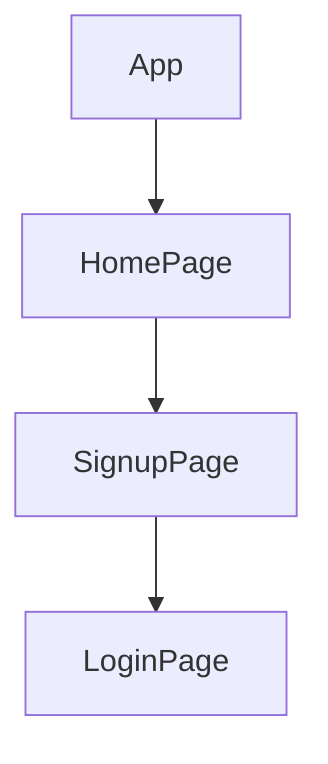

> 💻 PROJECT NAME ✨ => 💻   url-Shortner : URL Hashing System & Authentication System

> 
 

## 🔗 Profile Links✨

| Resume | Github                                                                                                                                   | Linkedin                                                                                                                                                            | Portfolio                                                                                                                                    | Blogger                                                                                                                                                           | Medium                                                                                                                                    |
| ------------- | ---------------------------------------------------------------------------------------------------------------------------------------- | ------------------------------------------------------------------------------------------------------------------------------------------------------------------- | -------------------------------------------------------------------------------------------------------------------------------------------- | -------------------------------------------------------------------------------------------------------------------------------------------- | -------------------------------------------------------------------------------------------------------------------------------------------- |
|  | |  | | | |  

## 💫Tech-Stack->

- #### For Frontend:-
   - `HTML5`
  - `CSS3`
  - `JavaScript `
  - `ReactJS`
  - `Redux`
    - #### For Backend:-
   - `NodeJS`
   - `ExpressJS`
    - `MongoDB `
- #### For deploy database:- 
    
     - `Vercel`
   
- #### For Styling:-  
   - `Chakra UI `
  
- #### For live Project: -
   - `Vercel`
   

## ⭕Steps to run our project:

✨Clone the repository.

✨Run the command `npm install` in both the frontend and backend folders.

✨Run the command `npm run server` in the backend folder.

✨Run the command `npm start` in the frontend folder on localhost:3000.

---
✨ # Architecture:
---
This URL Hashing System provides a comprehensive solution to KGS's marketing department's challenges with long URLs and UTM tracking. The system ensures appropriate authentication, association, and tracking of hashed URLs. It is built using the MERN stack (MongoDB, Express.js, React.js, and Node.js) for a robust and scalable architecture.Building a complete solution involves a series of steps.  Please note that this example is meant for educational purposes, and in a production environment, you would need to address additional concerns such as security, error handling, and scalability.

# Architecture Choice

The choice of the MERN stack was driven by the need for a flexible, scalable, and easy-to-integrate solution. Here's a brief overview:

$  MongoDB: Chosen as the database for its NoSQL nature, allowing flexibility in handling various data structures and scalability options.

$ Express.js: Used to create a RESTful API for seamless communication between the frontend and backend components.

$ React.js: Employed for building the frontend to provide a dynamic and responsive user interface.

$ Node.js: Serves as the runtime environment for the entire application, ensuring consistent execution.

# Authentication, Association, and Tracking
The system employs user authentication to ensure secure interactions. Hashed URLs are associated with their original counterparts, and click events are tracked for analytics, providing valuable insights for marketing strategies.

## Getting Started

### Prerequisites

    - Node.js and npm installed
    - MongoDB installed (for local development)

### Installation

1. **Clone the repository:**

       git clone https://github.com/yourusername/react-node-auth.git
       cd react-node-auth
   
Install dependencies for both backend and frontend:

    cd backend
    npm install
    cd ../frontend
    npm install
    
Run the development servers:

     Backend:
    cd backend
    npm run dev

    Frontend:
      cd frontend
      npm start
      
    Open your browser and visit http://localhost:3000 to see the app in action.

Form Validation

      Explain the rules and requirements for form validation in your application.

Error Messages

    Provide a list of possible form validation errors and their corresponding error messages.

Invalid Email Format:

     Message: "Please enter a valid email address."
     
Invalid Password:

     Message: "Password must be at least 8 characters long and include at least one lowercase letter, one uppercase letter, and one digit."
Invalid Phone Format:

    Message: "Please enter a valid 10-digit phone number."
User Already Exists:

    Message: "An account with this email address already exists. Please use a different email."
Server Error:

    Message: "Something went wrong on our end. Please try again later."

Backend (Node.js)

        The backend is a Node.js server using Express, MongoDB for data storage, bcrypt for password hashing, and JSON Web Tokens (JWT) for authentication.

Endpoints:

       /signup: User signup with validation.
      /login: User login with JWT token generation.
Frontend (React.js)

    The frontend is a React.js application with simple components for signup and login.

Components:

           Signup.js: User signup form.
          Login.js: User login form.
         
Hosting on Vercel

     Build the React app:
     cd frontend
    npm run build
    Install Vercel CLI:
    npm install -g vercel
    
Deploy to Vercel:

     cd frontend
    vercel
    
Follow the prompts to deploy your application.

Contributing

     💻 Contributions are welcome! Please follow the standard guidelines for contributing.

# Tests
---
$ Backend API:
  Write unit tests using testing libraries like Mocha or Jest.

$ Frontend (if applicable):
  Write unit tests using Jest and React Testing Library.
  
$ API documentation:
 Integrate Swagger for clear and interactive API documentation.

# Backend (Node.js, Express, MongoDB):

Use Express.js to create a RESTful API.
MongoDB to store the mappings between the hashed URLs and the original URLs.

# Frontend (React.js):

Build a simple UI for interacting with the URL shortening and redirection functionality.

# Hashing Algorithm:

Use a secure hashing algorithm (e.g., SHA-256) to generate unique hashes for the URLs.

# Security Considerations:

Implement input validation and sanitize user inputs to prevent potential security vulnerabilities.
Use HTTPS to secure data transmission.
Secure MongoDB connections and enforce access control.

# Testing:

Write unit tests for the backend API using testing libraries like Mocha or Jest.
Conduct end-to-end tests for the frontend using testing frameworks like Jest and React Testing Library.

---
# Documentation:

# Code Quality:

Organize your code logically, follow best practices, and implement error handling.
Keep backend and frontend code separate for maintainability.

# Scalability:

MongoDB can be scaled horizontally by adding more nodes to the cluster.
Use load balancing for the Express.js backend to handle increased traffic.

# Automation:

Implement a CI/CD pipeline for automated testing and deployment using tools like Jenkins, GitLab CI, or GitHub Actions.

# Swagger:

Integrate Swagger documentation for the API to assist other developers in understanding and interacting with your API.

# Acknowledgments:

Acknowledge any open-source libraries or tools used in your project.

# Git:

Keep your Git commits organized and use meaningful commit messages.
This MERN stack-based solution provides a full-stack application with a React.js frontend for user interaction and a Node.js backend with Express for handling URL shortening and redirection. Ensure to follow best practices for each component of the stack to create a clean, scalable, and maintainable solution.

## Features ✨:-
---
 | Serial No            | Feature                                                              |
| ----------------- | ------------------------
| 1 | User Signup and login, navbar , footer|
| 2 | Home Page Design, responsive design |

---
# Package.json(Dependency)✨:-

 | Serial No            | Backend                      |  Frontend      |
| ----------------- | ---------------------|------------------------ |
| 1 | nodemon | Chakra-ui |
| 2 | mongoose | React Router dom |
| 3 | cors | redux , react-icons |
| 4 | dotenv | react-redux , react-thunk |
| 5 | express | react-hot-toast |

⭕Steps to use our project:

This project demonstrates a simple authentication system using JWT tokens with a Node.js backend and a React.js frontend.

---✨Getting Started:
✨Initializing the Application: To start using the application, go to the frontend terminal and run the command npm start. This will launch the application locally, allowing access through your web browser at port 3000.

✨Home Page: When the application is launched, users will see the home page, which provides essential options for interaction such as signup and login.

---✨User Journey:

💫Signup: Upon launching the application, users are greeted with the home page, offering essential options for interaction like signup and login.

💫Login: Users are given the choice to log in. This initial step ensures a personalized experience within the application.

---

## Flow

---

<h1 align="center">✨Thank You✨</h1>

