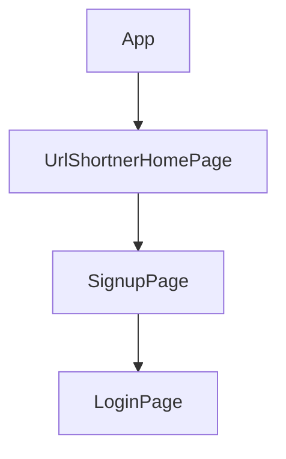

> 💻 PROJECT NAME ✨ => 💻   url-Shortner : URL Hashing System & Authentication System
 

---
## 🔗 Profile Links✨

| Resume | Github                                                                                                                                   | Linkedin                                                                                                                                                            | Portfolio                                                                                                                                    | Blogger                                                                                                                                                           | Medium                                                                                                                                    |
| ------------- | ---------------------------------------------------------------------------------------------------------------------------------------- | ------------------------------------------------------------------------------------------------------------------------------------------------------------------- | -------------------------------------------------------------------------------------------------------------------------------------------- | -------------------------------------------------------------------------------------------------------------------------------------------- | -------------------------------------------------------------------------------------------------------------------------------------------- |
|  | |  | | | |  

---
## 💫Tech-Stack->

- #### For Frontend:-
  
   - `HTML5`
  - `CSS3`
  - `JavaScript `
  - `ReactJS`
  - `Redux`
    
 - #### For Backend:-
   
   - `NodeJS`
   - `ExpressJS`
    - `MongoDB `
     
- #### For deploy database:- 
    
   - `Vercel`
   
- #### For Styling:-
  
  - `Chakraui`
  
- #### For live Project: -

  - `Vercel`
  
 - #### Hashing Library:-

   -  `object-hash`
  
---
## ⭕Steps to run our project:

✨Clone the repository.

✨Run the command `npm install` in both the frontend and backend folders.

✨Run the command `npm run dev` in the backend folder.

✨Run the command `npm start` in the frontend folder on localhost:3000.

---
## Features ✨:-
---
 | Serial No            | Feature                                                              |
| ----------------- | ------------------------
| 1 | User Signup and login, logout, navbar, footer|
| 2 | Home Page Design, responsive design |
| 3 |  Url Shortener & copy from clipboard |

---
# Package.json(Dependency)✨:-

 | Serial No            | Backend                      |  Frontend      |
| ----------------- | ---------------------|------------------------ |
| 1 | nodemon ,bcrypt | Chakra-ui |
| 2 | mongoose ,express-jwt | React Router dom |
| 3 | cors , jsonwebtoken | redux , react-icons |
| 4 | dotenv ,express | react-redux , react-thunk |
| 6 | body-parser | react-toastify , react|
| 7 | object-hash | react-hot-toast  , axios|

  

---
✨ # Architecture:
---
This URL Hashing System provides a comprehensive solution to KGS's marketing department's challenges with long URLs and UTM tracking. The system ensures appropriate authentication, association, and tracking of hashed URLs. It is built using the MERN stack (MongoDB, Express.js, React.js, and Node.js) for a robust and scalable architecture.Building a complete solution involves a series of steps.  Please note that this example is meant for educational purposes, and in a production environment, you would need to address additional concerns such as security, error handling, and scalability.

# Architecture Choice

The choice of the MERN stack was driven by the need for a flexible, scalable, and easy-to-integrate solution. Here's a brief overview:

$  MongoDB: Chosen as the database for its NoSQL nature, allowing flexibility in handling various data structures and scalability options.

$ Express.js: Used to create a RESTful API for seamless communication between the frontend and backend components.

$ React.js: Employed for building the front end to provide a dynamic and responsive user interface.

$ Node.js: Serves as the runtime environment for the entire application, ensuring consistent execution.

# Authentication, Association, and Tracking

The system employs user authentication to ensure secure interactions. Hashed URLs are associated with their original counterparts, and click events are tracked for analytics, providing valuable insights for marketing strategies.

---
## Getting Started 

    
# Functionality For Url Shortener & Authentication :-

  ⭕ URL Shortening
  
       Users can input long URLs, and the system generates a unique, shortened URL using a secure hashing algorithm (e.g., SHA-256).

 ⭕ URL Redirection

    Shortened URLs, when accessed, redirect users to their original, long URLs.

 ⭕ Copy to Clipboard

    Users can easily copy the shortened URL to the clipboard for quick sharing.

 ⭕ Error Handling
     
     The application incorporates robust error handling to ensure a smooth user experience:

    ✨Invalid URL: Users are notified when attempting to shorten an empty or invalid URL.

    ✨Shortened URL Copy: Users are informed if there is no URL to copy.

    ✨URL Shortening Failure: If an error occurs during the URL shortening process, users receive an error message.

    ✨Clipboard Copy Failure: If copying to the clipboard fails, users are notified of the error.

⭕ Form Validation on Authentication

      Explain the rules and requirements for form validation in your application.

⭕ Error Messages for Authentication

    Provide a list of possible form validation errors and their corresponding error messages.

    ⭕ Invalid Email Format:

     Message: "Please enter a valid email address."
     
    ⭕ Invalid Password:

     Message: "Password must be at least 8 characters long and include at least one lowercase letter, one uppercase letter, and one digit."
    ⭕ Invalid Phone Format:

    Message: "Please enter a valid 10-digit phone number."
    ⭕ User Already Exists:

    Message: "An account with this email address already exists. Please use a different email."
    ⭕ Server Error:

    Message: "Something went wrong on our end. Please try again later."

---
💫Backend (Node.js)

        The backend is a Node.js server using Express, MongoDB for data storage, bcrypt for password hashing, and JSON Web Tokens (JWT) for authentication.
        The URL shortening logic involves hashing the original URL using the object-hash library. 
        Enter the original URL in the provided input field.
        Click the "Shorten URL" button to generate a shortened URL.
        Copy the shortened URL and share it as needed.
        Users accessing the shortened URL will be redirected to the original long URL.

Endpoints:

       /signup: User signup with validation.
      /login: User login with JWT token generation.
      /:- The URL shortening logic involves hashing the original URL using the object-hash library.
     🌐 https://url-shortner-topaz-iota.vercel.app/api-doc:- for swagger view

      
💫Frontend (React.js)

    The front end is a React.js application with simple Components:- for signup and login, UrlShortner.
         
---
         
## Flow

---
⭕ Steps to Use Our Project

This project showcases a straightforward authentication system utilizing JWT tokens with a Node.js backend and a React.js frontend.

#✨ Getting Started

✨ Initializing the Application

Open your terminal and navigate to the frontend directory.
Run the command npm start to launch the application locally.
Access the application through your web browser at http://localhost:3000.

✨ Home Page

Upon launching the application, the home page welcomes users with essential options for interaction:

Signup: Allows new users to create an account.
Login: Provides access for existing users.
Logout: Logs the user out of the application.
Url Shortener: Navigates to the URL Shortener feature.

✨ User Journey:-

💫 Signup

Click on the "Signup" option on the home page.
Fill in the required information in the signup form.
Submit the form to create a new account.

💫 Login

Choose the "Login" option on the home page.
Enter your credentials in the login form.
Submit the form to access your personalized experience.

💫 Url Shortener

 "Url Shortener" feature on the home page.
Ensure that the original URL is complete and includes the necessary protocol (e.g., https:// or http://).
Enter the original URL in the provided input field.
Click the "Shorten URL" button to generate a shortened URL.
Copy the shortened URL to share it easily.
To test the shortened URL, paste it into your browser's address bar and press Enter. You will be redirected to the original long URL.

# Tips

Error Handling: If you encounter any issues or errors during the URL shortening process, check the error messages for guidance.
Usage: URL Shortener offers a seamless and user-friendly experience for quickly shortening and sharing URLs. Whether for marketing campaigns or everyday use, this application provides a reliable solution for managing and tracking your links.

---    

✨Hosting on Vercel

     Build the React app:
     cd frontend
    npm run build
    Install Vercel CLI:
    npm install -g vercel

    
Deploy to Vercel:

     cd frontend
     vercel
    Follow the prompts to deploy your application.

# Tests
---
$ Backend API:
  Write unit tests using testing libraries like Mocha Jest, and Postman.
  

$ Frontend 
(if applicable):
  Write unit tests using Jest and React Testing Library.
  
  
  

$ API documentation:
 Integrate Swagger for clear and interactive API documentation.

# Backend (Node.js, Express, MongoDB):

Use Express.js to create a RESTful API.
MongoDB stores the mappings between the hashed URLs and the original URLs.

# Frontend (React.js):

Build a simple UI for interacting with the URL shortening and redirection functionality.

# Hashing Algorithm:

Use a secure hashing algorithm (e.g., SHA-256) to generate unique hashes for the URLs.

# Security Considerations:

Implement input validation and sanitize user inputs to prevent potential security vulnerabilities.
Use HTTPS to secure data transmission.
Secure MongoDB connections and enforce access control.

---
# Documentation:

📋 TODO.md

🖇️AWS Free Tier Reminder:
Highlight AWS Free Tier limitations.

🖇️Database Choice Explanation:
Add a note in assumptions.md about choosing MongoDB over DynamoDB.

Contributing

     💻 Contributions are welcome! Please follow the standard guidelines for contributing.
---

<h1 align="center">✨Thank You✨</h1>

